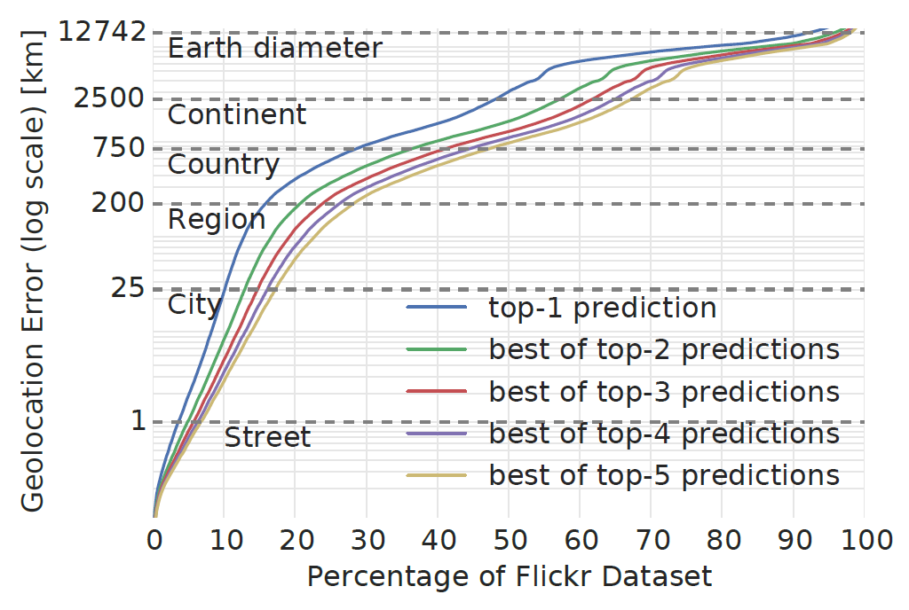
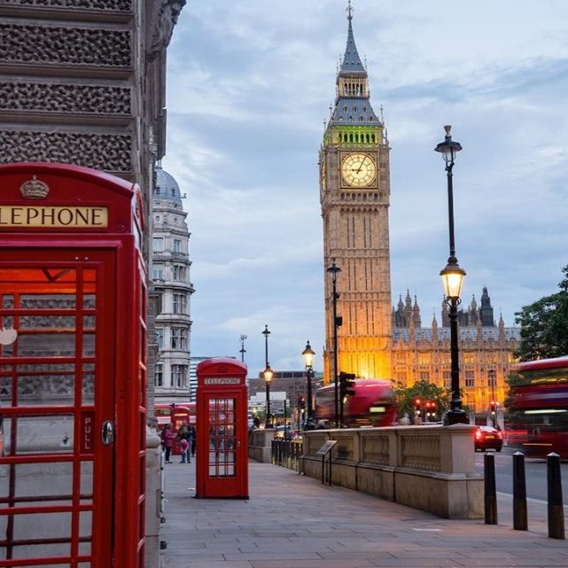
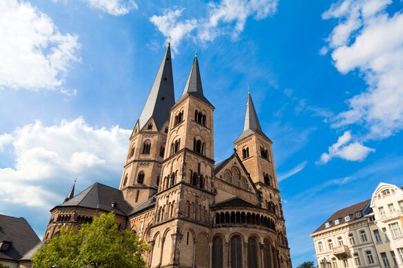
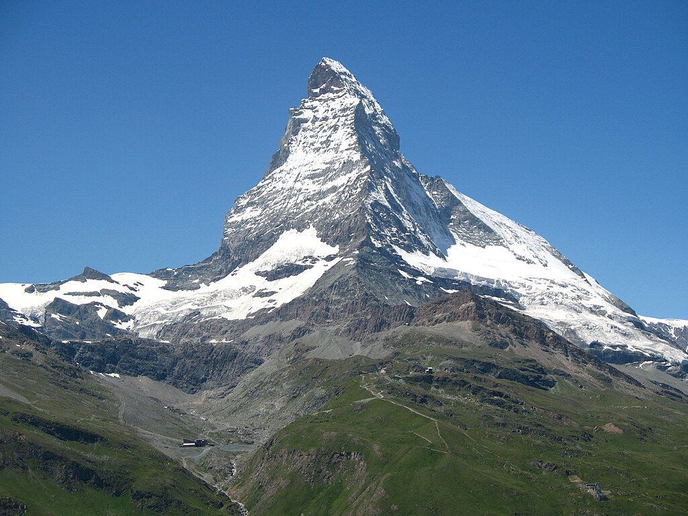
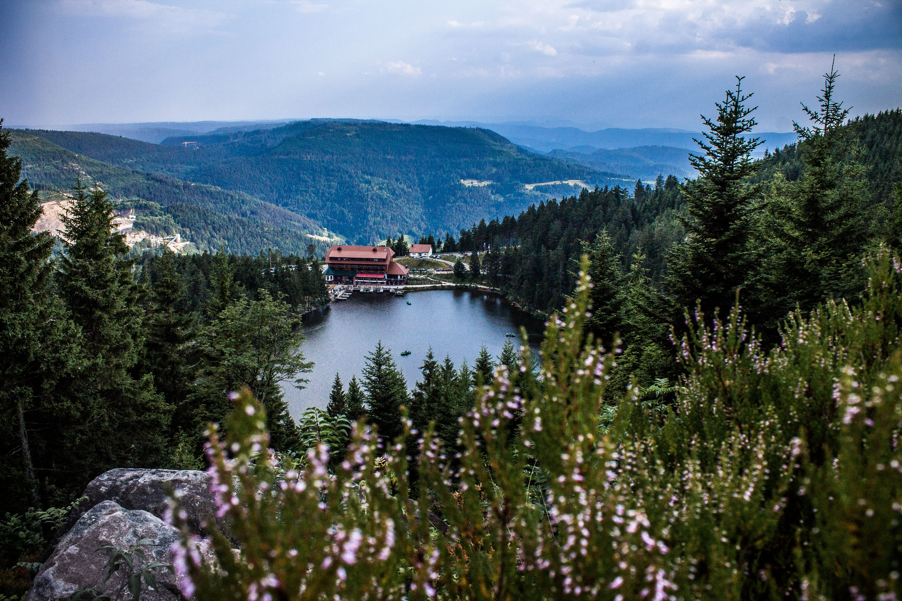
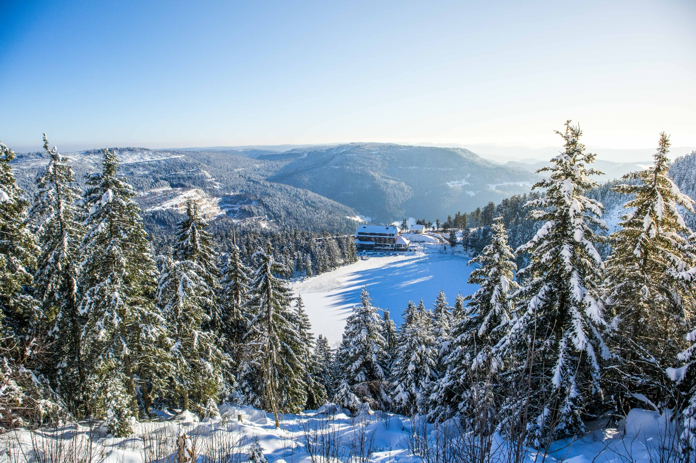
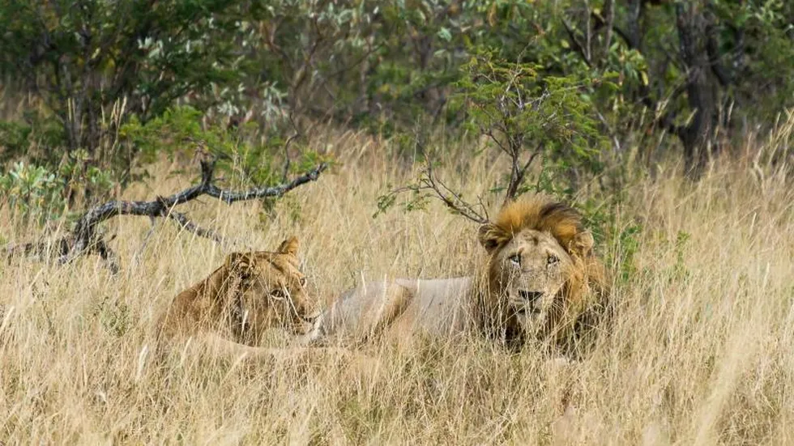
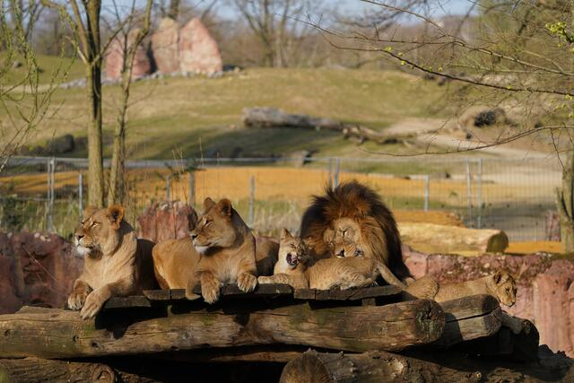

# Concept discovery of PlaNet-V2 using Superpixel and Sliding BlackBox

PlaNet is a convolutional neural network for geolocalizing images. In this project, the network is analysed more closely and a statement is made about how the network makes its decision and which parts of the image make the greatest contribution to this. For this purpose, a worklow was created (see figure 2) and applied to selected images. A Superpixel algorithm and a Sliding BlackBox algorithm were developed to mask certain areas in the image and test the sensitivity of the network to them.

This project was part of the Explainable Machine Learning seminar by Prof. Ribana Roscher, University of Bonn.

## PlaNet 

The convolutional neural network PlaNet can goelocalize images. For this purpose, only the pixels of the image are used as input information and the network outputs a probability distribution over the entire earth for the potential location where the image was taken. The PlaNet network was developed together with Google and published by Tobias Weyand et al. in the paper ["Planet-photo geolocation with convolutional neural networks"](https://link.springer.com/chapter/10.1007/978-3-319-46484-8_3).

The network is based on the Interception V3 architecture for  image classification according to Christian Szegedy et al. and was presented in the paper ["Rethinking the inception architecture for computer vision"](https://arxiv.org/abs/1512.00567). The division of the earth for the assignment of probabilities is based on the [S2 geometry](http://s2geometry.io/) of Google.

   

  <em>Fig 1: Accurency of PlaNet</em>

The network is trained with 9.1 million georeferenced images from the Internet. In the paper by Tobias Weyand et al. the network is analysed for accuracy, using a photo dataset from Flickr. The results are shown in Figure 1. The country accuracy is 28.4% and the continent accuracy is 48% for the top-1 prediction.

## Requirements

We used the given model from [Kaggle](https://www.kaggle.com/models/google/planet-v2), which is free avaliable. As the network is implemented in Tensorflow, the libraries [Tensorflow](https://www.tensorflow.org/) and [Tensorflow Hub](https://www.tensorflow.org/hub) are required. These can be installed with the commands `pip install tensorflow` and `pip install tensorflow_hub`. The S2 geometries are also required. The implementation is only compatible with certain Python versions and the installations and requirements are described [here](https://github.com/google/s2geometry). In this case, the library could be installed with `pip install s2sphere` on Python 3.6.9. Finally, a label map is required to assign the S2 geometries to the network. This can be downloaded [here](https://www.gstatic.com/aihub/tfhub/labelmaps/planet_v2_labelmap.csv).

## Workflow 

First a raw image is defined which needs to be processed in the workflow. The next step is the preparation of the raw image. Two different approaches were implemented to make the processes of machine learning explainable. The first approach pursues the strategy of dividing the raw image into superpixels and making them available for the further process. The second approach works with a Sliding BlackBox that is moved over the raw image and thus provides a series of individual images with masked areas. In the next step, the generated images with the Superpixel approach, the Sliding BlackBox and the raw images, are sent through the neural network. The output for each individual image is the probability for the top 5 predictions. In the final step, this information is further processed into heatmaps, which can identify image areas or image features that explain the decisions made by PlaNet.

   

  <em>Fig 2: Workflow</em>

### Sliding BlackBox

The Sliding BlackBox approach follows the strategy of covering a part of the raw image with a black box. To do this, a black box slides over the raw image step by step in columns and rows. The black box slides over the image in vertically and horizontally direction with a 50% overlap in each case. This creates a data set of images with the black box always placed in a different position. Together with the raw image, the data set is then applied to the PlaNet. For the raw image, the geocell with the highest probability is detected. The scores for all images in the data set predicted by the PlaNet in relation to the previously detected geocell are saved and provided for the creation of the heatmap. Each area of the hea tmap is colored according to its score. For better visualization, the display is converted to relative values and a suitable colour gradient is used. Areas that are likely to have a greater influence on the neural network's decision are colored yellow. Less important image areas are colored purple.

### Superpixel

The concept of Superpixels is akin to that of the [Sliding BlackBox](https://github.com/s7jaweig/EXML-WS-23-24---Planet-V2/tree/main?tab=readme-ov-file#sliding-blackbox).  The image is initially partitioned into superpixels, which are regions of similarity within an image, such as the sky, buildings, or vegetation. Typically, an image is divided into approximately 15 superpixels, although the exact number depends on the context being depicted. The aim is to identify which region has a significant impact on the final outcome. The PlaNet is then applied to the original image. The geocell with the highest output is identified and applied to each superpixel. Only the geocell with the corresponding score that produced the maximum output for the original image is of interest. The scores are then compared to determine which area of the image had a significant impact on the original image's result. To enhance comprehension of the results, the score values of the superpixels are scaled to a range of 0 to 255 and displayed in colour within the image.

### Network

In order to be able to process the images created in the two approaches, the images must have a certain size and resolution. The images can then be fed into the network. The output is analysed for the two approaches or the geoplots and saved as a text file.

### Geoplots

To create the geoplots, the cell number, the probability for these and the coordinates of the top 5 predictions are loaded from the network into Matlab. The [geoplot module](https://de.mathworks.com/help/matlab/ref/geoplot.html) is then used to create and save an overview and a detailed plot for each prediction. These plots are used to analyse the result of the network and check that it is correct.

## Data

In order to test the algotithms presented, some images from Google Images were selected and analysed using the workflow (see Figure 2).

An [image](https://cdn.ems-ambulance.com/media/_1274x1625_crop_center-center_80_none/12784/Londen.webp) of Big Ben in London is used to start with. This is assigned by PlaNet to cell 5219 with 28% probability and corresponds to the location where the image was taken.

   
  

  <em>Fig 3: Picture of the Big Ben in London (left) and its geoplot (right)</em>

Another [image](https://encrypted-tbn0.gstatic.com/images?q=tbn:ANd9GcRCSwARR5_k8Nk7WHJVG86TC_ITVw0cHZpKSs2gODKLS7Wb77bW) analysed is a photo of the Bonn Münster in Bonn, a somewhat less well-known city landmark. This is wrongly assigned with 24% to Koblenz.

   
   

  <em>Fig 4: Picture of the Bonner Münster in Bonn (left) and its geoplot (right)</em>

The [Matterhorn](https://upload.wikimedia.org/wikipedia/commons/thumb/c/cf/3818_-_Riffelberg_-_Matterhorn_viewed_from_Gornergratbahn.JPG/800px-3818_-_Riffelberg_-_Matterhorn_viewed_from_Gornergratbahn.JPG) is assigned to the correct cell 3687 with a probability of over 85%. This is intended to investigate the decision behaviour of mountains.

   
  

  <em>Fig 5: Picture of the Matterhorn in Switzerland (left) and its geoplot (right)</em>

To analyse the network in landscapes in summer and winter, two images (private) were used that were taken at exactly the same location at different times of the year.

   
   

  <em>Fig 6: Picture of the Mummelsee, Schwarzwald, in the summer (left) and in the winter (right)</em>

The network assigned the summer picture to different regions of the world. However, all locations were assigned to the correct latitude. In winter, the image was assigned to the Alps in the top 5 predictions, which is close to where the picture was taken.

   
   

  <em>Fig 7: Geoplot of the summer picture (left) and of the winter picture (right)</em>

Finally, two lion images are analysed with the network. The lions are once in the [wild](https://www.merkur.de/assets/images/2/175/2175880-in-suedafrika-ist-ein-75-jahre-alter-kroate-bei-der-loewenjagd-getoetet-worden-foto-philipp-laage-illustration-3s70.jpg) and once in the [zoo](https://media04.lokalkompass.de/article/2022/04/08/2/12221392_XL.jpg?1649412972).

   
   

  <em>Fig 8: Picture of lions in nature (left) and in a zoo (right)</em>

The lions in the wild were correctly located in Kruger National Park, South Africa. The lions from the zoo in Gelsenkirchen were not placed exactly in Gelsenkirchen, but were only assigned to regions in which there are zoos.

   
  

  <em>Fig 9: Geoplot of the picture in nature (left) and in a zoo (right)</em>

## Results

The analysis and evaluation of the results from Sliding BlackBox and Superpixels of the previously presented images are presented below. In order to facilitate the analysis, the generated heatmaps have been overlaid on the original image. This helps to identify regions of particular interest. You can always see on the left side the result of Sliding BlackBox and on the right side the result of Superpixels.

  
   

  <em>Fig. 11: Heatmaps for Big Ben in London</em>

The results for Big Ben in London appear contradictory. Big Ben is of little interest for the Sliding BlackBox, possibly due to the high density of geocells in central London. Several cells offer a view of Big Ben alone, but in combination with the surrounding areas, which are of greater interest for the Sliding BlackBox approach, Big Ben becomes less relevant. The telephone boxes and adjacent building in the foreground are relevant to the selected cell.
In contrast, the Big Ben is of great interest for the Superpixel approach due to its clear association with London. The remaining individual superpixels, however, cannot produce satisfactory results on their own and are not associated with London by the neural network. 
This image demonstrates the significance of context, which, on its own, does not have a strong influence (as seen in Superpixels), but has a greater overall impact than a single building. The importance of context is evident in this image.

  
   

  <em>Fig. 10: Heatmaps for Bonner Münster</em>

The heatmap for Sliding BlackBox and Superpixel appears similar for Bonner Münster, with the building having the strongest influence, particularly the towers. The network classifies the tree in the foreground, which obscures part of the building, as irrelevant and focuses on the unique building. The heatmap is stronger for Superpixels than for Sliding BlackBox.

  
   

  <em>Fig. 12: Heatmaps for Matterhorn</em>

The analysis of the Matterhorn image yielded impressive results. PlaNet accurately predicted the geocell in Switzerland where the image was taken with a high confidence level of 85%. Additionally, all other geocells are located nearby in Switzerland. Our analysis revealed the image areas that contributed the most to this decision. It is noteworthy that humans can easily recognize the Matterhorn's characteristic peak. However, both the Superpixel and Sliding BlackBox approaches have detected relevant image information at the foot of the mountain.

  
   

  <em>Fig. 15: Heatmaps for Sea in Sommer season</em>

In a further test, two images taken at the same location were analyzed. The difference is that one was taken in summer and the other in winter. The top 5 predictions for the summer image are distributed in Europe, North America and Central Asia. It is striking that all cells are located at approximately the same latitude. This could indicate similar characteristics of the vegetation in these areas. When analyzing with Superpixels and the Sliding BlackBox, the more distant vegetation is the most relevant. The foreground is rather uninteresting in both cases, as there is also a slight image blur here. The lake area is not of interest for both approaches, beacuse it is not unique for any region worldwide.

  
   

  <em>Fig. 16: Heatmaps for Sea in Winter season</em>
  
In the winter image, however, the predicted geocells are distributed very differently compared to the summer image. Here, all of the top 5 predictions are concentrated in the Alpine region in Europe. This image was actually taken not far from the Black Forest (Germany). The geocell that was predicted fifth is in the immediate neighborhood. Here, the Superpixel approach is used to detect the area of the frozen lake surface, the hotel and the vegetation in the background as influential. A similar behavior can be observed with the Sliding BlackBox approach. Here, the areas in the center of the image around the hotel are also weighted the highest. However, the snow-covered fir trees in the foreground are considered rather unimportant.

  
   

  <em>Fig. 13: Heatmaps for Lion in Zoo</em>

As demonstrated in the previous chapter, the localization of the lions in the zoo is inaccurate. Cells were selected where zoos exist worldwide, but not the correct cell. The superpixels reveal that the combination of vegetation in the background and the area with the grids have a greater influence on the result than the lions themselves. This is because the superpixel with the lions alone does not provide enough context to determine whether the image was taken in a zoo or in the wild in Africa. The superpixel containing only lions does not provide enough evidence to conclude that the image was taken in a zoo. It is important to note that the lions have only a minor influence.
  

  
   

  <em>Fig. 14: Heatmaps for Lion in Krueger National Park</em>

The network predicted the correct region for wild lions. Both approaches show that the lions have the greatest influence. The Sliding BlackBox approach highlights the importance of the environment surrounding the lions, which is typical of the savannah. The Superpixels approach also emphasizes the significance of the environment, with a major influence from the animals. Notably, the environment is more relevant than previously thought, specifically the typical savannah vegetation. This indicates that the network in this area has learned not only the animal species but also the type of environment. This is a positive outcome, as the generalization of the region seems to have been successful. 

## Conclusion

This project analyses the PlaNet network in detail to determine the image components that are crucial for the network's decision. Two methods are employed to mask parts of the image.

With both algorithms it could be shown that the architecture of the surrounding buildings and the background of the images play a major role. Unique buildings like Big Ben are also important, but due to the high density of geocells, the background is also needed. In addition, reference is often made to several areas of the image. To summarise, it can be concluded that the analysis with both algorithms are successful, even if the algorithms make different statements in some cases.

## References

* Weyand, T., Kostrikov, I., & Philbin, J. (2016). Planet-photo geolocation with convolutional neural networks. In Computer Vision-ECCV 2016: 14th European Conference, Amsterdam, The Netherlands, October 11-14, 2016, Proceedings, Part VIII 14 (pp. 37-55). Springer International Publishing.
* Szegedy, C., Vanhoucke, V., Ioffe, S., Shlens, J., & Wojna, Z. (2016). Rethinking the inception architecture for computer vision. In Proceedings of the IEEE conference on computer vision and pattern recognition (pp. 2818-2826).
* [https://www.kaggle.com/models/google/planet-v2](https://www.kaggle.com/models/google/planet-v2)
* [http://s2geometry.io/](http://s2geometry.io/)
  
EXML WS23/24 Uni Bonn - Explainable Machine Learinig Seminar: Planet-V2
by Franziskus Henkelmann, Jakob Weigand and Adrian Weng in February 2024
