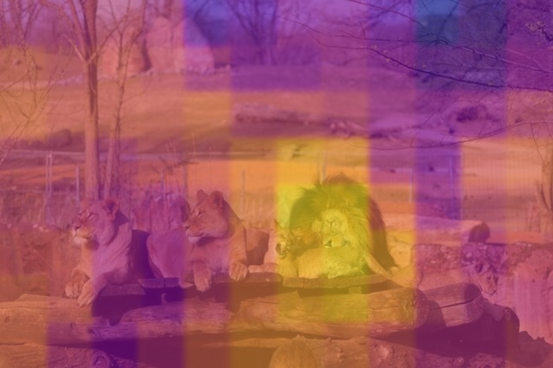

EXML WS23/24 Uni Bonn - Explainable Machine Learinig Seminar: Planet-V2
by Franziskus Henkelmann, Jakob Weigand and Adrian Weng in February 2024 

# Concept discovery of Planet-V2 using Superpixel and Sliding BlackBox

Beschreibung des Projektes goes here

# Requirements (Titus)

We used the given model from [Kaggle](https://www.kaggle.com/models/google/planet-v2), which is free avaliable.

# Workflow (Adi)
First a raw image is defined which is to be processed in the workflow. The next step is to prepare the raw image. Two different approaches were implemented to make the processes of machine learning explainable. The first approach pursues the strategy of dividing the raw image into superpixels and making them available for the further process. The second approach works with a sliding black box that is moved over the raw image and thus provides a series of individual images with masked areas. In the next step, the generated images of the data sets of the superpixel, the sliding black box and the raw images are sent through the neural network. The output for each individual image is the probability of how many percent of the image in the top 5 tiles has been solved. In the final step, this information is further processed into heat maps, which can identify image areas or image features that explain the decisions made by Planet-V2.

  

## Sliding BlackBox
The sliding black box approach follows the strategy of covering part of a raw image with a black box. To do this, a black box is slide over the raw image step by step in columns and rows. The black box is slid over the image both vertically and horizontally with a 50% overlap in each case. This creates a data set of images with the black box always placed in a different position. Together with the raw image, the data set is then applied to the Planet-V2. For the raw image, the geocell with the highest probability is detected. The scores for all images in the dataset predicted by the Planet-V2 in relation to the previously detected geocell are saved and provided for the creation of the heatmap. Each area of the heatmap is colored according to its score. For better visualization, the display is converted to relative values and a suitable colour gradient is used. Areas that are likely to have a greater influence on the neural network's decision are colored yellow. Less important image areas are colored purple.

## Superpixel
The concept of superpixels is akin to that of the [Sliding BlackBox](https://github.com/s7jaweig/EXML-WS-23-24---Planet-V2/tree/main?tab=readme-ov-file#sliding-blackbox).  The image is initially partitioned into superpixels, which are regions of similarity within an image, such as the sky, buildings, or vegetation. Typically, an image is divided into approximately 15 superpixels, although the exact number depends on the context being depicted. The aim is to identify which region has a significant impact on the final outcome. The Planet is then applied to the original image. The geocell with the highest output is identified and applied to each superpixel. Only the geocell with the corresponding score that produced the maximum output for the original image is of interest. The scores are then compared to determine which area of the image had a significant impact on the original image's result. To enhance comprehension of the results, the score values of the superpixels are scaled to a range of 0 to 255 and displayed in colour within the image.

## Planet (Titus)

## Geoplots (Titus)

# Data (Titus)
Worauf haben wir getestet vorstellen, mit Geoplots (Titus)

* Bonner Münster
* Matterhorn
* London
* Sommer/Winter
* Beide Löwen

# Ergebnisse (Adi, Jakob)

  

  <em>Fig. 1: Geoplots for Bonner Münster</em>

  
   

  <em>Fig. 1: Solutions for Bonner Münster</em>

  

  <em>Fig. 1: Geoplots for Big Ben</em>

  
   

  <em>Fig. 1: Solutions for Bonner Münster</em>

  

  <em>Fig. 1: Geoplots for Matterhorn</em>

  
   

  <em>Fig. 1: Solutions for Bonner Münster</em>

  

  
   

  

  
   

  

  
   

In a further test, two images taken at the same location were analyzed. The difference is that one was taken in summer and the other in winter. The top 5 predictions for the summer image are distributed in Europe, North America and Central Asia. It is striking that all cells are located at approximately the same latitude. This could indicate similar characteristics of the vegetation in these areas. When analyzing with superpixels and the sliding black box, the more distant vegetation is the most relevant. The foreground is rather uninteresting in both cases, as there is also a slight image blur here.

  

  
   

In the winter image, however, the predicted geocells are distributed very differently compared to the summer image. Here, all of the top 5 predictions are concentrated in the Alpine region in Europe. This image was actually taken not far from the Black Forest (Germany). The geocell that was predicted fifth is in the immediate neighborhood.

# Zusammenfassung  (Titus)

# Referenzen (Alle)

* https://www.kaggle.com/models/google/planet-v2
* Weyand, T., Kostrikov, I., & Philbin, J. (2016). Planet-photo geolocation with convolutional neural networks. In Computer Vision–ECCV 2016: 14th European Conference, Amsterdam, The Netherlands, October 11-14, 2016, Proceedings, Part VIII 14 (pp. 37-55). Springer International Publishing.
  
