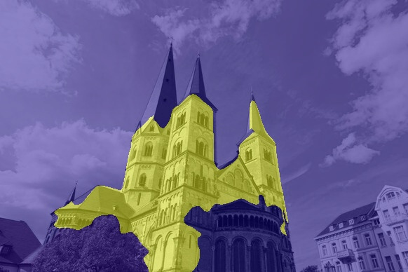

EXML WS23/24 Uni Bonn - Explainable Machine Learinig Seminar: Planet-V2
by Franziskus Henkelmann, Jakob Weigand and Adrian Weng in February 2024 

# Concept discovery of Planet-V2 using Superpixel and Sliding BlackBox

Beschreibung des Projektes goes here

# Requirements (Titus)

We used the given model from [Kaggle](https://www.kaggle.com/models/google/planet-v2), which is free avaliable.

# Workflow (Adi)
First a raw image is defined which is to be processed in the workflow. The next step is to prepare the raw image. Two different approaches were implemented to make the processes of machine learning explainable. The first approach pursues the strategy of dividing the raw image into superpixels and making them available for the further process. The second approach works with a sliding black box that is moved over the raw image and thus provides a series of individual images with masked areas. In the next step, the generated images of the data sets of the superpixel, the sliding black box and the raw images are sent through the neural network. The output for each individual image is the probability of how many percent of the image in the top 5 tiles has been solved. In the final step, this information is further processed into heat maps, which can identify image areas or image features that explain the decisions made by Planet-V2.

  

## Sliding BlackBox
Konzept erklären

## Superpixel
The idea behind superpixels is similar to that of the [Sliding BlackBox](https://github.com/s7jaweig/EXML-WS-23-24---Planet-V2/tree/main?tab=readme-ov-file#sliding-blackbox). The image is first divided into superpixels. Superpixels are similar regions within an image, such as the sky, buildings or vegetation. A single image is divided into around 15 superpixels, the exact number depending on the context being displayed. The aim is to be able to make a statement about which region has a particularly strong influence on the final result.
The Planet is applied to the original image. The result is the geocell for which the output is maximum. The network is then applied to each superpixel. Only the geocell with the corresponding score for which the original image produced the maximum output is of interest as the output. The scores are scored to be compared. This makes it possible to determine which area of the image had a particularly large influence on the result of the original image. For a better understanding of the results, the score values of the superpixels are scaled to the range 0 to 255 and displayed in colour in the image. 

Alternativ:
The concept of superpixels is akin to that of the [Sliding BlackBox](https://github.com/s7jaweig/EXML-WS-23-24---Planet-V2/tree/main?tab=readme-ov-file#sliding-blackbox).  The image is initially partitioned into superpixels, which are regions of similarity within an image, such as the sky, buildings, or vegetation. Typically, an image is divided into approximately 15 superpixels, although the exact number depends on the context being depicted. The objective is to identify which region has a significant impact on the final outcome. The Planet is then applied to the original image.  The geocell with the highest output is identified and applied to each superpixel. Only the geocell with the corresponding score that produced the maximum output for the original image is of interest. The scores are then compared to determine which area of the image had a significant impact on the original image's result. To enhance comprehension of the results, the score values of the superpixels are scaled to a range of 0 to 255 and displayed in colour within the image.

## Planet (Titus)

## Geoplots (Titus)

# Data (Titus)
Worauf haben wir getestet vorstellen, mit Geoplots (Titus)

* Bonner Münster
* Matterhorn
* London
* Sommer/Winter
* Beide Löwen

# Ergebnisse (Adi, Jakob)

  

  <em>Fig. 1: Geoplots for Bonner Münster</em>

  
   

  <em>Fig. 1: Solutions for Bonner Münster</em>

# Zusammenfassung  (Titus)

# Referenzen (Alle)

* https://www.kaggle.com/models/google/planet-v2
* Weyand, T., Kostrikov, I., & Philbin, J. (2016). Planet-photo geolocation with convolutional neural networks. In Computer Vision–ECCV 2016: 14th European Conference, Amsterdam, The Netherlands, October 11-14, 2016, Proceedings, Part VIII 14 (pp. 37-55). Springer International Publishing.
  
